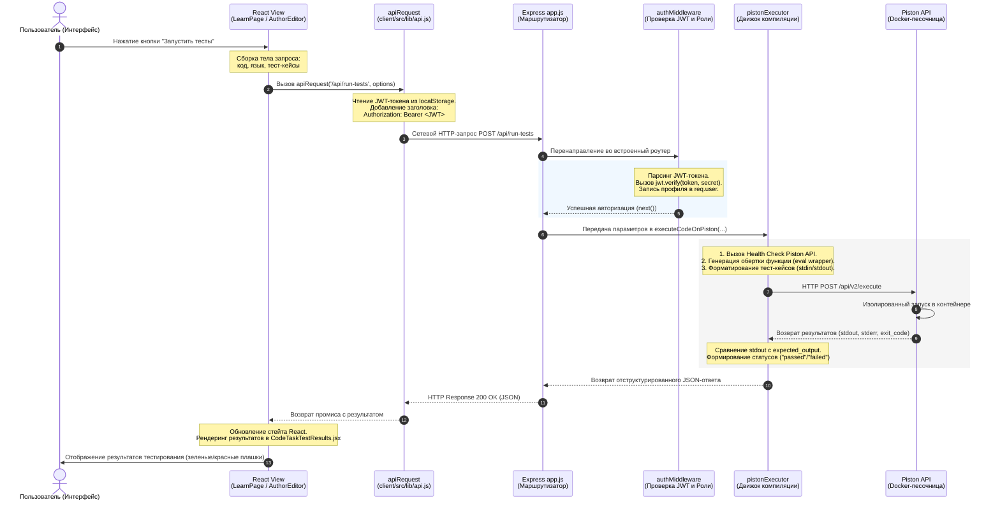

# Черновик разделов 3.3 и 3.4 для дипломной работы

---

## 3.3 Реализация серверной части и API (обзор)

Серверная часть платформы представляет собой распределённый веб-сервис, построенный на базе программной платформы **Node.js** с использованием легковесного веб-фреймворка **Express.js**. Выбор данной технологической связки обусловлен асинхронной моделью ввода-вывода (Non-blocking I/O) и событийно-ориентированной архитектурой, что гарантирует высокую пропускную способность системы при обработке конкурентных сетевых запросов. 

В качестве СУБД используется реляционная база данных **PostgreSQL**, подключение к которой осуществляется через оптимизированный пул соединений (драйвер `pg`), что обеспечивает стабильность и минимальные задержки при выполнении транзакций. Для выполнения изолированного и безопасного запуска кода пользователей на стороне сервера интегрирован внешний микросервис **Piston API**, развёрнутый в изолированном Docker-контейнере. Интеграция с искусственным интеллектом (AI-ассистент) реализована на уровне сервисного слоя с использованием API современных больших языковых моделей (LLM).

### 3.3.1 Структура проекта серверной части

Архитектура серверной части следует современному паттерну разделения ответственности (Separation of Concerns). Основная логика приложения распределена по четырём ключевым каталогам, каждый из которых выполняет свою строго регламентированную роль в обработке данных. 

Структура основных каталогов серверной части, отвечающих за приём запросов, безопасность, бизнес-логику и внешние интеграции, приведена на рисунке 3.Z.

```text
server/src/ (Основные архитектурные слои)
├── routes/              # Маршрутизаторы запросов (API-эндпоинты)
├── middleware/          # Промежуточное ПО (аутентификация JWT, разграничение ролей)
├── services/            # Сервисный слой (бизнес-логика, транзакции БД, хранилище)
└── modules/             # Специализированные функциональные модули (Piston, LLM API)
```
*Рисунок 3.Z — Архитектурные каталоги серверной части системы (routes, middleware, services, modules)*

После поступления запроса от клиентского приложения процесс его сквозной обработки бэкендом последовательно проходит через все четыре выделенных каталога. Данный жизненный цикл укладывается в следующую схему:

1. **Входная точка и маршрутизация (каталог `routes/`):** 
   HTTP-запрос от фронтенда (например, `POST /api/run-tests` или `POST /api/ai/chat`) поступает на сервер Express и сопоставляется с правилами маршрутизации, объявленными в каталоге `routes/`. Здесь файлы маршрутов (такие как `codeRoutes.js`, `aiRoutes.js`, `authRoutes.js`) определяют целевой эндпоинт, метод запроса (GET, POST, PATCH, DELETE) и связывают его с соответствующим обработчиком.

2. **Контроль безопасности и валидация (каталог `middleware/`):** 
   Прежде чем запрос будет передан к бизнес-логике, он перехватывается промежуточным программным обеспечением (Middleware) из каталога `middleware/`. Здесь выполняется аутентификация пользователя (декодирование и верификация токена JWT в `authMiddleware.js`), а также авторизация прав доступа (RBAC) на основе ролей (студент, автор, администратор). Если запрос не проходит проверку подлинности или прав доступа, он немедленно отклоняется сервером на этом этапе с кодом ошибки `401` или `403`, предотвращая несанкционированный доступ.

3. **Службы стандартной бизнес-логики и работы с СУБД (каталог `services/`):** 
   Для выполнения стандартных операций с базой данных PostgreSQL (сохранение прогресса, изменение контента лекций, добавление новых блоков) или файловым сервером управление передаётся в слой сервисов (`services/`). Сервисы (например, `attachmentService.js`) инкапсулируют бизнес-правила системы, обрабатывают данные, обращаются к СУБД через пул подключений и возвращают готовые структурированные результаты.

4. **Интеграция с внешними сервисами и изолированные вычисления (каталог `modules/`):**
   Если запрос связан со сложными функциональными задачами — такими как безопасная компиляция и выполнение студенческого кода в песочнице или генерация интеллектуальных подсказок ИИ — управление делегируется модулям из каталога `modules/`. 
   * Модуль `pistonExecutor.js` форматирует код, генерирует обёртку для stdin/stdout, обращается к Docker-песочнице Piston API и анализирует соответствие вывода тест-кейсам.
   * Модуль `ai.js` совместно с `promptBuilder.js` динамически собирает контекст урока и отправляет структурированный промпт к API больших языковых моделей (LLM), получая ответ для отправки пользователю.

После прохождения этих этапов сформированный JSON-ответ передаётся обратно в маршрутизатор `routes/` и отправляется клиенту. Такой сквозной процесс гарантирует высокую безопасность, модульность и изолированность вычислений.

### 3.3.2 Реализация системы маршрутизации и Middleware

Безопасность сетевого взаимодействия и разграничение прав доступа в платформе обеспечиваются с помощью концепции **Middleware (промежуточного программного обеспечения)** Express. Каждому входящему HTTP-запросу, требующему авторизации, перед передачей в контроллер необходимо пройти валидацию на промежуточных слоях.

Главным элементом защиты данных является модуль [authMiddleware.js](file:///c:/Users/Foxi8/diplom/web-trainer-platform/server/src/middleware/authMiddleware.js). Он реализует:
1. **Аутентификацию пользователя (`authMiddleware`)**: Извлекает токен авторизации стандарта JWT (JSON Web Token) из заголовка HTTP `Authorization: Bearer <token>`, валидирует его с помощью секретного ключа сервера и, в случае успеха, записывает расшифрованные данные пользователя (ID, роль) в объект запроса `request.user`. В случае невалидного или просроченного токена запрос немедленно прерывается с HTTP-статусом `401 Unauthorized`.
2. **Авторизацию на основе ролей (`requireRole`)**: Функция высшего порядка, проверяющая соответствие роли авторизованного пользователя (`request.user.role`) списку разрешённых ролей для конкретного эндпоинта. При несовпадении возвращается статус `403 Forbidden`.

Ниже представлена демонстрация работы промежуточного ПО на примере маршрутизатора [codeRoutes.js](file:///c:/Users/Foxi8/diplom/web-trainer-platform/server/src/routes/codeRoutes.js):

```javascript
import { Router } from "express";
import { executeCodeOnPiston } from "../modules/pistonExecutor.js";
import { authMiddleware } from "../middleware/authMiddleware.js";

const router = Router();

// Глобальное подключение middleware аутентификации для всех эндпоинтов данного роутера
router.use(authMiddleware);

/**
 * Эндпоинт POST /api/run-tests
 * Доступен только авторизованным пользователям (студентам и авторам)
 * Выполняет запуск решения задачи в изолированной среде и прогоняет тесты
 */
router.post("/run-tests", async (req, res) => {
  const { language, code, test_cases, function_name } = req.body;

  if (!code) {
    return res.status(400).json({ error: "Code is required." });
  }

  try {
    // Делегирование выполнения изолированному движку Piston
    const executionResult = await executeCodeOnPiston(
      code,
      language,
      test_cases || [],
      function_name
    );
    res.json(executionResult);
  } catch (error) {
    console.error("Test execution error:", error.message);
    res.status(500).json({ error: "Ошибка выполнения тестов" });
  }
});

export default router;
```

### 3.3.3 Жизненный цикл HTTP-запроса: сквозной путь от клиента до сервера

Далее рассматривается типовой процесс обработки запроса в системе, начиная с отправки данных с клиентской части и заканчивая формированием ответа сервером через цепочку маршрутов, middleware и сервисного слоя. Для детального понимания механизмов взаимодействия клиента и сервера рассмотрим полный путь прохождения запроса на примере проверки интерактивного задания по программированию. В качестве сценария возьмём отправку написанного кода на проверку (кнопка «Запустить тесты»).



**Описание этапов жизненного цикла запроса:**

1. **Инициирование действия на клиенте:** Студент нажимает кнопку запуска в интерфейсе урока (`LearnPage.jsx`), либо автор тестирует задание в конструкторе (`AuthorCourseContentEditorPage.jsx`).
2. **Подготовка сетевого запроса:** Клиентский компонент собирает параметры: язык (JavaScript/Python), написанный код решения, массив тест-кейсов (каждый из которых содержит входной `stdin` и ожидаемый `stdout`), а также имя проверяемой функции.
3. **Генерация HTTP-запроса:** Вызывается служебная функция `apiRequest()` из [client/src/lib/api.js](file:///c:/Users/Foxi8/diplom/web-trainer-platform/client/src/lib/api.js). Она обращается к модулю [auth.js](file:///c:/Users/Foxi8/diplom/web-trainer-platform/client/src/lib/auth.js) для получения JWT-токена из `localStorage` браузера и встраивает его в HTTP-заголовок запроса:
   `Authorization: Bearer <JWT-токен>`
4. **Сетевой транспорт:** HTTP-запрос `POST /api/run-tests` отправляется по сети на веб-сервер.
5. **Приём и маршрутизация запроса Express:** Сервер Express в [app.js](file:///c:/Users/Foxi8/diplom/web-trainer-platform/server/src/app.js) ловит запрос, определяет его путь и направляет в группу маршрутов `codeRoutes`.
6. **Слой безопасности (Middleware):** Активируется `authMiddleware`. Токен извлекается, верифицируется. Если валидация пройдена, в объекте запроса создаётся поле `req.user` с метаданными пользователя, и управление передаётся финальному обработчику маршрута (контроллеру).
7. **Форматирование задачи в Piston-совместимый формат:** Контроллер передаёт данные в метод `executeCodeOnPiston` в модуле [pistonExecutor.js](file:///c:/Users/Foxi8/diplom/web-trainer-platform/server/src/modules/pistonExecutor.js). Движок проверяет работоспособность песочницы. Если имя функции задано, движок автоматически дописывает к коду пользователя обёртку для чтения данных из стандартного потока ввода (`stdin`) и вызова целевой функции (для JavaScript через файловую систему `fs.readFileSync(0, 'utf-8')` и `eval`, для Python через `sys.stdin.read()`).
8. **Изолированное выполнение в Docker-песочнице:** Модуль `pistonExecutor` отправляет HTTP-запрос к локально развёрнутому сервису Piston API (`/api/v2/execute`). Piston запускает код в чистом одноразовом Docker-контейнере с ограничением по времени выполнения и ресурсам. Данные `stdin` подаются на вход программы. Результаты работы (`stdout`, `stderr`, код завершения `exit_code`) возвращаются на бэкенд платформы.
9. **Анализ результатов бэкендом:** Бэкенд сопоставляет полученный вывод программы (`stdout`) с ожидаемым эталоном, проверяет отсутствие ошибок компиляции (`exit_code === 0`), формирует итоговый статус (`passed` или `failed`) по каждому тесту и агрегирует их в общий ответ. При наличии системных ошибок выполнения бэкенд маскирует полные пути путей контейнера для предотвращения утечки информации, возвращая пользователю безопасный текст ошибки.
10. **Отправка ответа:** Сервер сериализует результат в формат JSON и отправляет HTTP-ответ со статусом `200 OK` клиенту.
11. **Отрисовка в UI:** React-приложение получает данные, обновляет локальное состояние. Компонент рендеринга тестов `CodeTaskTestResults.jsx` визуализирует каждый пройденный тест в виде наглядного отчета.

### 3.3.4 Визуализация результатов тестирования на клиенте

Полученный от сервера JSON-ответ передаётся в качестве входного параметра (пропса `results`) в переиспользуемый клиентский React-компонент [CodeTaskTestResults.jsx](file:///c:/Users/Foxi8/diplom/web-trainer-platform/client/src/components/CodeTaskTestResults.jsx). Визуализация результатов строится по следующим алгоритмам:

1. **Анализ метаданных и локализация статусов:**
   Компонент считывает значение поля `results.status`. Для удобства пользователя системные статусы динамически переводятся на русский язык: `"passed"` и `"accepted"` отображаются как «Успешно» (зелёный цвет), а `"failed"` и `"error"` — как «Ошибка» (красный цвет). Системные сообщения об успехе или количестве проваленных тестов также локализуются (например, `"All tests passed successfully!"` заменяется на «Все проверки успешно пройдены!»).

2. **Динамическая сортировка по критичности ошибок:**
   Массив результатов по каждому тест-кейсу (`results.tests_result.details`) проходит предварительную обработку и сортировку:
   ```javascript
   const sortedDetails = (results.tests_result?.details || [])
     .map((detail, idx) => ({ ...detail, originalIdx: idx }))
     .sort((a, b) => {
       if (a.passed === b.passed) return 0;
       return a.passed ? 1 : -1; // Упавшие тесты (passed === false) поднимаются наверх
     });
   ```
   Благодаря этой сортировке все проваленные тесты принудительно отображаются в самом верху списка. Это позволяет пользователю мгновенно сфокусироваться на ошибках, не тратя время на скроллинг успешно пройденных проверок.

3. **Разграничение уровней доступа к деталям проверок (Студент / Автор):**
   Компонент реализует строгую логику безопасности отображения тест-кейсов, которая зависит от роли авторизованного пользователя:
   * **Режим студента (`isAuthor = false`):** Если тест пройден успешно, его детали скрываются для лаконичности интерфейса. Если тест провален, студент видит подробное сравнение: входные данные (`stdin`), ожидаемый эталон (`stdout`) и свой реальный вывод программы (`actual`). Однако, если преподаватель при создании задачи отметил данный тест-кейс как «скрытый» (`is_hidden: true`), то при его провале система полностью блокирует вывод данных, отображая предупреждение: *«Скрытый тест. Детали не отображаются»*. Это предотвращает метод «подгонки» решения под тест-кейсы (hardcoding) и стимулирует студента к написанию алгоритмически корректного кода.
   * **Режим автора (`isAuthor = true`):** Преподаватель (автор задания) обладает полным доступом к системе диагностики. Для него отображаются все детали как открытых, так и скрытых тест-кейсов. Дополнительно в интерфейс выводится специальная **панель отладки Piston**, которая вытягивает необработанные логи компилятора (`STDOUT` и `STDERR`) напрямую из песочницы Docker. Это позволяет автору мгновенно диагностировать синтаксические ошибки или бесконечные циклы в эталонном коде.

Визуальное оформление результатов обеспечивается набором CSS-классов (таких как `.test-case-detail.passed`, `.test-case-detail.failed`), которые окрашивают карточки тестов в контрастные пастельные тона с чётким визуальным акцентом на статусе выполнения.

---

## 3.4 Реализация фронтенд части (обзор)

Фронтенд-часть системы разработана как современное одностраничное веб-приложение (**Single Page Application**) на базе библиотеки **React**. Сборка проекта осуществляется с помощью инструмента нового поколения **Vite**, что минимизирует время сборки и обеспечивает быструю горячую перезагрузку модулей (HMR) в процессе разработки. Для реализации декларативного адаптивного дизайна используется классический структурированный **CSS (Vanilla CSS)**, что гарантирует полный контроль над стилями без накладных расходов.

### 3.4.1 Структура папок клиентской части

Логика клиентской части платформы спроектирована по принципу модульности, что упрощает масштабирование интерфейсов и поддержку кодовой базы. Логические единицы разделены на визуальные представления и служебные модули управления данными.

Основная логика отображения страниц размещена в каталоге `pages`, а переиспользуемые элементы пользовательского интерфейса — в каталоге `components`. Структура этих ключевых каталогов, отвечающих за визуальную презентацию и интерфейсную разметку, представлена на рисунке 3.X.

```text
client/src/ (Презентационный слой)
├── main.jsx             # Инициализация React, рендеринг дерева в DOM-элемент #root
├── App.jsx              # Корневой компонент приложения, конфигурация маршрутизации (React Router)
├── styles.css           # Централизованный файл стилей (дизайн-система, переменные, компоненты)
├── components/          # Переиспользуемые функциональные и UI-компоненты
│   ├── AIChatPanel.jsx  # Панель интеллектуального AI-ассистента
│   ├── AppLayout.jsx    # Базовый каркас интерфейса (шапка, меню, сайдбар, футер)
│   ├── CodeEditor.jsx   # Изолированный компонент редактора кода (Monaco Editor)
│   ├── CodeTaskEditor.jsx # Интерфейс настройки практических заданий (для автора)
│   ├── CodeTaskTestResults.jsx # Панель отображения результатов выполнения тестов
│   ├── ProtectedRoute.jsx # Компонент-фильтр для защиты приватных роутов на клиенте
│   └── ui/              # Мелкие атомарные UI-компоненты (кнопки, диалоговые окна)
└── pages/               # Крупные компоненты страниц (контроллеры отображения)
    ├── AdminUsersPage.jsx  # Панель администрирования пользователей системы
    ├── AuthorCourseContentEditorPage.jsx # Конструктор уроков и интерактивных блоков автора
    ├── AuthorCourseEditorPage.jsx # Редактор обложки и карточки курса автором
    ├── AuthorDashboardPage.jsx    # Панель управления курсами автора
    ├── CourseDetailPage.jsx       # Страница с описанием конкретного курса
    ├── CoursesPage.jsx            # Каталог доступных учебных курсов
    ├── DashboardPage.jsx          # Главный личный кабинет пользователя
    ├── LearnPage.jsx              # Рабочее интерактивное пространство студента
    ├── LoginPage.jsx              # Страница входа в систему
    └── RegisterPage.jsx           # Страница регистрации в системе
```
*Рисунок 3.X — Структура каталогов презентационного слоя клиентской части (pages, components)*

Важно подчеркнуть, что клиентская часть платформы представляет собой полноценное веб-приложение, а не просто визуальный «фасад» или набор статичных HTML/JSX-страниц, видимых пользователю. За кадром функционирует мощный системный слой, отвечающий за фоновое взаимодействие с сервером, управление сессиями и интеллектуальную обработку информации. 

Сюда относятся специализированные **React-хуки** (`hooks`) для реактивного управления состояниями и авторизационным доступом при обмене данными с сервером, сетевые **библиотечные обёртки** (`lib`), стандартизирующие и упрощающие вызовы серверного API, а также **вспомогательные утилиты** (`utils`). В каталоге `utils` содержатся сборщики интерактивного ИИ-контекста, собирающие детали урока для отправки нейросети, и парсеры перекрёстных ссылок (шагов), функциональные особенности которых подробно рассматриваются в последующих разделах работы.

Структура служебных каталогов, обеспечивающих бизнес-логику фронтенда, приведена на рисунке 3.Y.

```text
client/src/ (Служебный слой бизнес-логики)
├── hooks/               # Пользовательские React-хуки для работы с API и состояниями
│   ├── useAuthUser.js   # Хук управления состоянием авторизации и данными профиля
│   └── useToast.js      # Хук вывода всплывающих уведомлений
├── lib/                 # Инфраструктурные модули сетевого уровня
│   ├── api.js           # Обертки сетевых запросов fetch API (apiRequest, apiFormRequest)
│   └── auth.js          # Утилиты сохранения и чтения токена JWT из localStorage
└── utils/               # Вспомогательные хелпер-модули
    ├── aiContextBuilders.js  # Сборщики текстового контекста урока для отправки в ИИ
    └── extractStepRefs.js    # Утилиты обработки шагов и ссылок на учебные блоки
```
*Рисунок 3.Y — Структура служебных каталогов клиентской части (hooks, lib, utils)*

### 3.4.2 Диаграмма композиции и иерархия вложенности компонентов

Проектирование классических статических диаграмм компонентов для современных React-приложений затруднено из-за высокой степени динамизма и глубокой вложенности JSX-элементов. Компоненты в React строятся по принципу древовидной композиции, где одни элементы вкладываются в другие через пропсы или специальное свойство `children`. 

Для наглядного представления архитектуры интерфейсов ниже описаны структуры вложенности JSX-файлов для двух ключевых пользовательских сценариев платформы.

#### 1. Иерархическая структура интерфейса обучения студента (`LearnPage.jsx`)
Описывает структуру интерактивного учебного кабинета, где студент изучает теорию, прикрепляет файлы, проходит тесты и общается с ИИ.

```text
App (App.jsx)
 └── ToastProvider (хук уведомлений)
      └── LearnPage (LearnPage.jsx)
           └── AppLayout (AppLayout.jsx — базовый каркас приложения)
                ├── Header (Шапка профиля, навигация, кнопка выхода)
                └── Main Content (Двухколоночная адаптивная разметка)
                     ├── Left Column (Учебный материал)
                     │    ├── Lesson Title & ProgressBar (Индикация прогресса)
                     │    └── Map of Blocks (Рендеринг блоков теории и практики в цикле)
                     │         ├── TextBlock (Отображение форматированной теории)
                     │         ├── AttachmentList (Список скачиваемых PDF/DOCX файлов)
                     │         ├── QuizBlock (Задание-тест с множественным выбором)
                     │         └── StudentPracticeEditor (Интерактивный редактор кода)
                     │              ├── CodeEditor (CodeEditor.jsx — Monaco Editor)
                     │              ├── ActionButtons (Кнопки "Запустить код", "Сбросить")
                     │              └── CodeTaskTestResults (Результаты тестов)
                     └── Right Column (Интеллектуальный ассистент)
                          └── AIChatPanel (AIChatPanel.jsx — панель ИИ-чата)
                               ├── ChatHistory (Список сообщений пользователя и ИИ)
                               ├── SystemModeStatus (Индикатор текущего режима подсказок)
                               └── ChatInputForm (Поле ввода с кнопкой отправки запроса)
```

#### 2. Иерархическая структура конструктора курса автора (`AuthorCourseContentEditorPage.jsx`)
Описывает интерфейс преподавателя, позволяющий конструировать уроки, прикреплять файлы, настраивать тестовые сценарии и проверять эталонные решения.

```text
App (App.jsx)
 └── ToastProvider (хук уведомлений)
      └── AuthorCourseContentEditorPage (AuthorCourseContentEditorPage.jsx)
           └── AppLayout (AppLayout.jsx)
                ├── Header (Навигация автора)
                └── Workspace (Двухколоночный интерфейс конструктора)
                     ├── Sidebar (Карта уроков)
                     │    ├── LessonsList (Список уроков с поддержкой Drag-and-Drop)
                     │    └── CreateLessonForm (Кнопка и форма добавления нового урока)
                     └── Editor Workspace (Область проектирования текущего урока)
                          ├── LessonTitleForm (Редактирование метаданных урока)
                          ├── BlocksList (Список блоков урока с поддержкой Drag-and-Drop сортировки)
                          │    ├── TheoryEditor (Редактор текста теории)
                          │    ├── FileUploader (Интерфейс загрузки методических материалов)
                          │    └── CodeTaskEditor (CodeTaskEditor.jsx — Конструктор заданий)
                          │         ├── LangSelector (Выбор языка программирования)
                          │         ├── PlaceholderCodeEditor (Monaco Editor для стартового шаблона)
                          │         ├── TestBenchesList (Список тест-кейсов: входные/выходные данные)
                          │         └── AuthorTestPanel (Панель валидации задания)
                          │              ├── CodeEditor (Monaco Editor для написания эталона автором)
                          │              ├── RunTestButton (Запуск проверки эталонного решения)
                          │              └── CodeTaskTestResults (Отчет по тест-кейсам для автора)
                          └── Right Sidebar Assistant (Панель ИИ-поддержки методиста)
                               └── AIChatPanel (AIChatPanel.jsx — Генератор контента с помощью ИИ)
```

### 3.4.3 Ключевые переиспользуемые компоненты платформы

Переиспользование кода является базовым архитектурным паттерном платформы, позволяющим избежать дублирования логики (принцип DRY — Don't Repeat Yourself). В системе выделяются два ключевых высокоуровневых переиспользуемых компонента.

#### 1. Интерактивный редактор кода ([CodeEditor.jsx](file:///c:/Users/Foxi8/diplom/web-trainer-platform/client/src/components/CodeEditor.jsx))
Разработан на базе профессиональной библиотеки `@monaco-editor/react` (движок среды VS Code). Он изолирует в себе конфигурацию редактора, подключение тем оформления и маппинг языков программирования.

**Параметры компонента (Props):**
* `value` (строка) — отображаемый исходный код;
* `onChange` (функция) — обратный вызов при изменении текста;
* `language` (строка) — целевой язык (автоматически сопоставляется с внутренними идентификаторами Monaco: `javascript` -> `javascript`, `python` -> `python`, `cpp` -> `cpp` и др.);
* `height` (число) — высота рабочей области;
* `readOnly` (булево) — режим «только для чтения» (используется для демонстрации примеров кода).

**Области переиспользования:**
Компонент `CodeEditor` повторно используется в двух совершенно разных модулях системы:
1. **На стороне студента (`LearnPage.jsx`):** внедряется в интерактивное практическое задание, позволяя студенту писать код решения задачи с подсветкой синтаксиса, автодополнением и автоформатированием.
2. **На стороне автора (`CodeTaskEditor.jsx`):** используется дважды:
   * Для создания *стартового шаблона кода* (placeholder code), который увидит студент при первом открытии задачи.
   * В панели *авторского тестирования* для написания эталонного решения. Это позволяет автору написать правильный код прямо в браузере и мгновенно протестировать корректность добавленных тест-кейсов перед публикацией задачи.

#### 2. Интеллектуальный чат-ассистент ([AIChatPanel.jsx](file:///c:/Users/Foxi8/diplom/web-trainer-platform/client/src/components/AIChatPanel.jsx))
Компонент инкапсулирует в себе интерфейс диалога с искусственным интеллектом, логику отображения истории сообщений, обработку анимации загрузки ответа от сервера и индикацию режимов подсказок ИИ.

**Области переиспользования (интеграция в трех ключевых элементах интерфейса):**
Согласно архитектурной схеме, чат-панель интегрирована ровно в трех местах веб-приложения:
1. **Десктопная панель обучения студента (`LearnPage.jsx`):** отображается стационарно в правой колонке экрана (`className="assistant-panel desktop-assistant-panel"`). Помогает студенту оперативно разбираться с теорией и ошибками в коде во время прохождения урока.
2. **Мобильная панель обучения студента (`LearnPage.jsx`):** адаптирована под вертикальные экраны мобильных устройств (`className="assistant-panel assistant-panel-mobile"`). Скрывается в выдвижное оверлей-меню (Drawer) для экономии экранного пространства на смартфонах и планшетах.
3. **Методический ассистент автора (`AuthorCourseContentEditorPage.jsx`):** встраивается в интерфейс редактора курсов. Помогает преподавателю генерировать текстовые материалы уроков, придумывать идеи для практических задач и автоматически составлять тест-кейсы.

**Динамическая адаптация контекста в `AIChatPanel`:**
Компонент является интеллектуальным, поскольку автоматически меняет логику формирования контекста запроса к API в зависимости от того, кто с ним взаимодействует:
* Если панель открыта **студентом**, утилита `aiContextBuilders.js` собирает контекст текущей открытой лекции, написанного студентом кода и деталей возникшей ошибки компиляции. ИИ инструктируется выступать в роли «сократовского наставника» — не давать готовый ответ, а наводить студента на самостоятельное решение.
* Если панель открыта **автором (преподавателем)**, собирается контекст структуры всего текущего урока, драфтов теории и авторского эталонного кода. ИИ переходит в режим «методического помощника», помогая дополнять текст лекций, находить логические ошибки в объяснениях и формулировать корректные вопросы.

---

## 3.5 Обеспечение безопасности и разграничения прав доступа

### 3.5.5 Кратко про аутентификацию и middleware

Аутентификация каждого входящего HTTP-запроса к API бэкенда основана на использовании промежуточного ПО (Middleware) и токенов **JWT (JSON Web Token)** в режиме без сохранения состояния (stateless). При выполнении любого защищенного запроса клиентское React-приложение автоматически считывает токен из `localStorage` и прикрепляет его к HTTP-заголовку авторизации в формате `Authorization: Bearer <JWT-токен>`. Такой подход исключает хранение сессионного состояния в памяти сервера или базе данных, повышая общую производительность и упрощая горизонтальное масштабирование системы.

На стороне веб-сервера промежуточное ПО Express перехватывает сетевой HTTP-запрос до того, как он будет направлен финальному контроллеру бизнес-логики. Функция `authMiddleware` осуществляет проверку заголовков, извлекает токен и выполняет криптографическую верификацию цифровой подписи с использованием секретного ключа сервера (`jwtSecret`). При успешной проверке декодированная полезная нагрузка (идентификатор пользователя `id` и роль `role`) помещается в объект запроса `req.user`, после чего вызывается метод `next()` для продолжения цепочки обработки. Если токен отсутствует, поврежден или просрочен, выполнение запроса немедленно прекращается возвратом клиенту ответа с HTTP-статусом `401 Unauthorized` без выполнения дальнейшей логики.

Компактная программная реализация функции промежуточного ПО представлена ниже:

```javascript
// Файл: server/src/middleware/authMiddleware.js
export function authMiddleware(req, res, next) {
  // (1) Извлечение HTTP-заголовка авторизации
  const auth = req.headers.authorization;
  // (2) Проверка наличия заголовка и префикса Bearer
  if (!auth || !auth.startsWith("Bearer ")) 
    return res.status(401).json({ message: "Authorization token is required" });
  try {
    // (3) Верификация JWT-токена и запись профиля пользователя в req.user
    req.user = jwt.verify(auth.slice(7), config.jwtSecret);
    // (4) Успешный переход к следующему обработчику в Express
    return next();
  } catch {
    // (5) Возврат ошибки 401 при просроченном или невалидном токене
    return res.status(401).json({ message: "Invalid or expired token" });
  }
}
```

Таким образом, детальное рассмотрение процессов регистрации, авторизации и аутентификации пользователей позволяет сделать вывод о формировании надежного контура безопасности разрабатываемой веб-платформы. Сочетание криптографического хэширования паролей при регистрации, защищенного выпуска токенов доступа при авторизации и сквозной верификации сессий с помощью механизмов middleware при каждом HTTP-запросе гарантирует защиту конфиденциальных данных и строгое разграничение прав доступа между студентами, авторами курсов и администраторами системы.

---

### 3.7.3 Реализация безопасного хранения и доступа к файловым вложениям лекций

Для блока лекционных материалов реализована возможность добавления файловых вложений, используемых для сопровождения учебного контента. Для загрузки и хранения материалов форматов DOCX и PDF спроектирована подсистема безопасной обработки пользовательских файлов. Экранная форма добавления вложений представлена на рисунке 3.42.

[Здесь располагается Рисунок 3.42 — Интерфейс загрузки файловых вложений в лекционный блок]

Основной задачей подсистемы является предотвращение несанкционированного доступа к файловым ресурсам, защита от загрузки потенциально опасного содержимого и обеспечение контролируемого доступа к материалам курса. 

В процессе реализации предусмотрены жесткие ограничения на тип, количество и размер загружаемых файлов:
1. **Ограничение по объему:** Максимальный размер одного загружаемого файла строго лимитирован и составляет **20 МБ** (обработка на сервере выполняется промежуточным ПО `multer` с возвратом HTTP-статуса `413 Payload Too Large` в случае превышения лимита).
2. **Ограничение по типу:** Допускается загрузка материалов исключительно в форматах **PDF** и **DOCX**.
3. **Защита от подмены MIME-типа (MIME-Type Spoofing Protection):** Проверка расширения файла дублируется верификацией сигнатуры файла (Magic Bytes) на уровне серверного буфера. Для документов формата PDF выполняется проверка наличия стартовых байтов `%PDF`, а для формата DOCX — валидация структуры заголовка ZIP-архива (`0x50 0x4B 0x03 0x04`). Это исключает маскировку исполняемых вредоносных сценариев под видом документов.
4. **Ограничение по количеству вложений:** Загрузка файлов реализована поштучно (метод `.single("file")`), при этом на уровне пользовательского интерфейса рекомендуется прикреплять не более 5-10 активных вложений на один лекционный блок для сохранения эргономики страницы.

Алгоритм проверки параметров загрузки файлов представлен на рисунке 3.43.

[Здесь располагается Рисунок 3.43 — Алгоритм проверки и валидации загружаемых файлов]

Хранение файлов организовано по изолированной модели, при которой пользовательские файлы размещаются отдельно от основной структуры веб-приложения (в каталоге `/uploads/courses/:courseId/`). Для исключения конфликтов имён и предотвращения прямого доступа к путям (атаки класса Path Traversal) каждому файлу при загрузке присваивается уникальный идентификатор на базе стандарта **UUIDv4**, используемый при физическом сохранении на диске.

Доступ к вложениям осуществляется через серверную часть приложения с предварительной проверкой прав пользователя (маршрут `/api/attachments/:storedName`). Скачивание материалов доступно только пользователям, имеющим соответствующие права доступа к курсу (проверяется связь студента с курсом через таблицу зачислений `enrollments`), что обеспечивает централизованный контроль операций с файлами и исключает прямое обращение к файловому хранилищу.

В системе реализована гибридная модель хранения данных, при которой бинарные файлы размещаются в файловом хранилище сервера под маскированными именами UUID, а метаданные о файлах (оригинальное имя, размер в байтах, MIME-тип, дата загрузки и ссылка) сериализуются в JSON-массив и сохраняются в текстовом поле `attachment_url` таблицы `lesson_blocks` базы данных, что снижает нагрузку на СУБД и упрощает управление вложениями.


