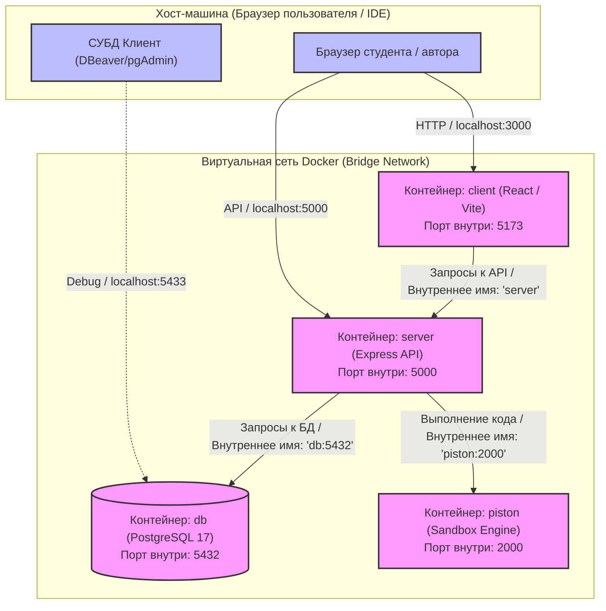

# Раздел 3.8 Развёртывание и запуск. Архитектура контейнеризации проекта

## 3.8.1 Введение в стратегию контейнеризации и обоснование выбора Docker

Для обеспечения стабильного функционирования, масштабируемости и простоты развёртывания интерактивной платформы обучения программированию была разработана архитектура на основе технологии контейнеризации приложений. В качестве основного инструмента контейнеризации используется платформа **Docker**, а управление многоконтейнерной средой осуществляется с помощью **Docker Compose**.

Выбор Docker в качестве основы для развёртывания и локальной разработки обоснован следующими ключевыми факторами:
1. **Изоляция среды выполнения кода (Sandboxing):** Платформа предусматривает автоматическую проверку программных решений, отправляемых пользователями (студентами). Выполнение произвольного кода на основном сервере представляет критическую угрозу безопасности (уязвимости типа RCE — Remote Code Execution). Использование изолированных контейнеров для песочницы гарантирует, что выполняемый код не получит доступ к файловой системе хоста или к процессам других сервисов.
2. **Воспроизводимость окружения (Reproducibility):** Контейнеризация устраняет проблему «работает на моей машине» (*works on my machine*). Все разработчики, тестировщики, а также сервер продакшена используют абсолютно идентичные сборки операционной системы, интерпретаторов и библиотек (Node.js, PostgreSQL, Piston).
3. **Упрощение процесса локальной разработки:** Новым разработчикам или проверяющим дипломную работу преподавателям достаточно установить Docker и выполнить одну команду для автоматической сборки и запуска всей экосистемы (база данных, фронтенд, бэкенд, песочница компиляции).
4. **Микросервисный подход:** Приложение разделено на функциональные компоненты с четко разграниченными зонами ответственности, общающиеся между собой по протоколу HTTP внутри изолированной виртуальной сети Docker.

---

## 3.8.2 Архитектура мультиконтейнерного окружения

Архитектура системы состоит из **четырех взаимосвязанных контейнеров**, объединенных в общую виртуальную сеть типа `bridge`. Каждый контейнер решает свою специализированную задачу:

1. **`client` (Фронтенд-приложение):**
   * **Технологический стек:** React, Vite, Monaco Editor.
   * **Базовый образ:** `node:22-alpine`.
   * **Назначение:** Предоставление пользовательского интерфейса, отображение курсов, интерактивный редактор кода, диалоговое окно ИИ-ассистента и личный кабинет.
   * **Порты:** Внутренний порт Vite `5173` проброшен на внешний порт хост-машины `3000`.

2. **`server` (Бэкенд-приложение / API-сервер):**
   * **Технологический стек:** Node.js, Express, pg (PostgreSQL driver), Axios.
   * **Базовый образ:** `node:22-alpine`.
   * **Назначение:** Реализация бизнес-логики, аутентификация (JWT), управление структурой курсов, формирование промптов для ИИ-ассистента (Yandex GPT), проксирование запросов на выполнение кода в песочницу.
   * **Порты:** Внутренний порт сервера `5000` проброшен на внешний порт хоста `5000`.

3. **`db` (База данных):**
   * **Технологический стек:** PostgreSQL 17.
   * **Базовый образ:** `postgres:17-alpine`.
   * **Назначение:** Хранение учетных записей пользователей, структуры курсов, уроков, блоков теории, тестов, решений студентов и истории сообщений с ИИ-ассистентом.
   * **Порты:** Внутренний порт `5432` проброшен на внешний порт хоста `5433` (во избежание конфликтов с локально установленной СУБД разработчика).

4. **`piston` (Изолированная песочница для выполнения кода):**
   * **Технологический стек:** Piston Engine (высокопроизводительный движок выполнения кода с открытым исходным кодом от EngineerMan).
   * **Базовый образ:** `ghcr.io/engineer-man/piston:latest`.
   * **Назначение:** Безопасное, быстрое и изолированное компилирование и выполнение кода, отправленного студентами или авторами курсов при проверке тестов.
   * **Порты:** Внутренний порт `2000` проброшен на внешний порт хоста `2001`.

Ниже представлена Mermaid-диаграмма взаимодействия контейнеров в инфраструктуре Docker:



---

## 3.8.3 Детальный разбор конфигурационных файлов контейнеризации

### 1. Манифест оркестрации: `docker-compose.yml`

Файл `docker-compose.yml` описывает структуру сервисов, зависимости между ними, тома для персистентного хранения данных и переменные окружения. 

Рассмотрим ключевые блоки конфигурации:

```yaml
version: '3.8'

services:
  client:
    build: ./client
    ports:
      - "3000:5173"
    depends_on:
      - server
    volumes:
      - ./client:/app
      - /app/node_modules
    environment:
      - VITE_API_URL=

  server:
    build: ./server
    ports:
      - "5000:5000"
    depends_on:
      - db
      - piston
    env_file:
      - .env
    environment:
      - DATABASE_URL=postgresql://postgres:postgres@db:5432/web_trainer_platform
      - PISTON_URL=http://piston:2000
      - PORT=5000

  db:
    image: postgres:17-alpine
    restart: always
    ports:
      - "5433:5432"
    environment:
      - POSTGRES_USER=postgres
      - POSTGRES_PASSWORD=postgres
      - POSTGRES_DB=web_trainer_platform
    volumes:
      - pgdata:/var/lib/postgresql/data
      - ./schema.sql:/docker-entrypoint-initdb.d/init.sql

  piston:
    image: ghcr.io/engineer-man/piston:latest
    restart: always
    ports:
      - "2001:2000"
    privileged: true
    dns:
      - 8.8.8.8
      - 1.1.1.1
    volumes:
      - piston_packages:/piston/packages
      - piston_isolate:/piston/isolate

volumes:
  pgdata:
  piston_packages:
  piston_isolate:
```

#### Анализ архитектурных решений в `docker-compose.yml`:
* **`depends_on` (Управление порядком запуска):** Сервис `client` ожидает запуска бэкенда `server`. Сервер, в свою очередь, ожидает готовности контейнера базы данных `db` и песочницы `piston`. Это минимизирует ошибки подключения при холодном старте.
* **Переопределение сетевых хостов:** Внутри виртуальной сети Docker контейнеры могут обращаться друг к другу по именам объявленных сервисов. В связи с этим в настройках `server` переменная `DATABASE_URL` переопределена на `db:5432` вместо стандартного `localhost:5432`, а `PISTON_URL` — на `http://piston:2000`.
* **Автоматическая инициализация СУБД:** Строка `- ./schema.sql:/docker-entrypoint-initdb.d/init.sql` монтирует файл инициализации структуры БД хоста внутрь контейнера PostgreSQL. Официальный образ Postgres автоматически выполняет любые SQL-скрипты, расположенные в директории `/docker-entrypoint-initdb.d/`, при первом создании базы данных. Это исключает необходимость вручную запускать миграции при первичном развертывании.
* **Политика перезапуска (`restart: always`):** Для базы данных и песочницы включен автоматический перезапуск при возникновении сбоев или падении процессов.
* **Изолированный запуск кода в `piston`:** 
  * Директива `privileged: true` необходима для работы утилиты `isolate` (используемой внутри Piston для создания легковесных chroot-песочниц на уровне ядра Linux).
  * Директива `dns` с публичными DNS-серверами Google (`8.8.8.8`) и Cloudflare (`1.1.1.1`) обеспечивает надежное сетевое соединение внутри контейнера Piston для загрузки и установки дополнительных компиляторов и пакетов языков программирования при первоначальной настройке.
  * Персистентные тома `piston_packages` и `piston_isolate` вынесены в именованные volumes, что сохраняет установленные языковые пакеты (например, Node.js, Python, GCC) между перезапусками контейнеров.

---

### 2. Сборка фронтенд-контейнера: `client/Dockerfile`

Для сборки контейнера клиентской части используется Dockerfile на базе легковесного дистрибутива Alpine Linux с установленной средой Node.js:

```dockerfile
FROM node:22-alpine

WORKDIR /app

# Копируем зависимости
COPY package*.json ./
RUN npm install

# Копируем исходный код клиента
COPY . .

# Открываем порт Vite
EXPOSE 5173

# Запускаем Vite с флагом --host, чтобы он был доступен извне контейнера
CMD ["npm", "run", "dev", "--", "--host", "0.0.0.0"]
```

#### Объяснение шагов сборки:
1. **`FROM node:22-alpine`:** Использование минимального образа на базе Alpine Linux снижает итоговый размер контейнера (менее 150 МБ) и уменьшает вектор атак на безопасность за счет отсутствия неиспользуемых утилит ОС.
2. **Кэширование слоев Docker:** Сначала копируются файлы манифеста зависимостей `package*.json`, после чего выполняется `npm install`. Только затем копируется весь исходный код (`COPY . .`). Это позволяет Docker кэшировать слой с установленными `node_modules`. Если код приложения изменился, но список зависимостей остался прежним, стадия `npm install` пропускается, что ускоряеет пересборку контейнера в десятки раз.
3. **`EXPOSE 5173`:** Документирует внутренний порт, который будет слушать приложение.
4. **Флаг `--host 0.0.0.0`:** По умолчанию Vite запускается на локальном интерфейсе `127.0.0.1`, что делает его недоступным извне контейнера. Запуск с флагом `--host 0.0.0.0` принуждает Vite слушать все сетевые интерфейсы, позволяя Docker перенаправлять трафик с хост-машины внутрь контейнера.

---

### 3. Сборка бэкенд-контейнера: `server/Dockerfile`

Бэкенд собирается аналогичным образом, обеспечивая быстрое развертывание Node.js-сервера:

```dockerfile
FROM node:22-alpine

WORKDIR /app

# Копируем файлы зависимостей и устанавливаем их
COPY package*.json ./
RUN npm install

# Копируем весь исходный код сервера
COPY . .

# Открываем порт, на котором работает сервер
EXPOSE 5000

# Команда для запуска сервера
CMD ["npm", "start"]
```

Команда `npm start` запускает основной файл бэкенда `src/index.js`, который поднимает Express-сервер на порту `5000` и инициализирует подключение к СУБД PostgreSQL и песочнице Piston.

---

## 3.8.4 Процесс разработки и жизненный цикл (Development Workflow)

Одной из сложнейших задач при использовании Docker в процессе активной разработки является обеспечение «горячей перезагрузки» (Hot Reload). Без специальной настройки любое изменение в кодовой базе требовало бы полной пересборки образа (`docker compose build`), что неприемлемо снижает скорость разработки.

Для решения этой проблемы в конфигурации Docker Compose применены **Bind Mounts (связанные тома)**:

```yaml
volumes:
  - ./client:/app
  - /app/node_modules
```

### Как это работает:
1. **Синхронизация исходного кода:** Строка `- ./client:/app` монтирует локальную директорию `./client` с хост-машины разработчика в директорию `/app` внутри контейнера. Любое изменение файла в редакторе кода (например, VS Code) на хосте мгновенно отражается внутри контейнера.
2. **Сохранение внутренней структуры зависимостей:** Строка `- /app/node_modules` является так называемым *анонимным томом*. Она указывает Docker замаскировать директорию `/app/node_modules` внутри контейнера от перезаписи локальной папкой хост-машины. Это критически важно, так как бинарные зависимости Node.js (например, компилируемые под конкретную архитектуру ОС модули, такие как `bcrypt`) должны устанавливаться внутри Linux-окружения контейнера и не должны заменяться версиями с хост-системы Windows/macOS.
3. **Hot Reloading:** Vite (в клиенте) и Node.js с флагом `--watch` (в сервере) отслеживают изменения файлов в реальном времени через системные события файловой системы (inotify) и автоматически обновляют работающее приложение без перезапуска контейнера.

---

## 3.8.5 Пошаговая инструкция по запуску проекта

Для развертывания проекта в локальном или серверном окружении необходимо выполнить следующие шаги:

1. **Предварительные требования:**
   * Установить Docker Desktop (для Windows/macOS) или Docker Engine/Compose (для Linux).
   * Склонировать репозиторий с исходным кодом проекта.

2. **Настройка переменных окружения:**
   * Создать файл `.env` в корневом каталоге проекта на основе шаблона `.env.example`:
     ```bash
     cp .env.example .env
     ```
   * Настроить параметры подключения к Yandex GPT API (для работы AI-ассистента) и указать секретный ключ для JWT-токенов:
     ```env
     JWT_SECRET=super_secret_key_for_jwt_tokens
     YANDEX_API_KEY=your_yandex_gpt_api_key
     YANDEX_FOLDER_ID=your_yandex_folder_id
     ```

3. **Сборка и первый запуск контейнеров:**
   * Выполнить в терминале команду сборки и запуска в фоновом режиме:
     ```bash
     docker compose up --build -d
     ```
   * Данная команда автоматически:
     * Скачает базовые образы Alpine, PostgreSQL и Piston.
     * Соберет локальные Dockerfile для клиента и сервера.
     * Запустит изолированную сеть и свяжет контейнеры.
     * Поднимет базу данных PostgreSQL и автоматически накатит структуру таблиц из `schema.sql`.

4. **Дополнительная настройка сред выполнения в Piston (установка компиляторов):**
   * Для возможности запуска решений студентов на различных языках программирования, необходимо установить соответствующие пакеты внутрь песочницы Piston. Это делается с помощью встроенного пакетного менеджера Piston CLI.
   * Например, для установки поддержки Python и JavaScript (Node.js) выполняются команды:
     ```bash
     # Установка Python 3
     docker compose exec piston piston cli install python 3.10.0
     
     # Установка Node.js (JavaScript)
     docker compose exec piston piston cli install nodejs 16.3.0
     ```

5. **Проверка работоспособности:**
   * Открыть браузер и перейти по адресу: `http://localhost:3000` — для доступа к веб-интерфейсу платформы обучения.
   * Для отладки API-запросов доступна точка входа: `http://localhost:5000/api/...`
   * Для подключения к БД напрямую с хоста (например, через DBeaver) использовать адрес `localhost`, порт `5433`, имя пользователя `postgres`, пароль `postgres`, база данных `web_trainer_platform`.

6. **Остановка окружения:**
   * Для остановки работы всех контейнеров без потери данных в БД выполнить:
     ```bash
     docker compose down
     ```
   * Для полной очистки окружения (включая тома базы данных и установленных языков Piston) выполнить:
     ```bash
     docker compose down -v
     ```

---

## 3.8.6 Выводы и преимущества выбранного подхода к развертыванию

Использование Docker и Docker Compose при разработке интерактивной образовательной платформы «Web Trainer» обеспечило ряд ключевых преимуществ:
1. **Безопасное выполнение произвольного кода:** Бэкенд делегирует исполнение решений студентов изолированному движку Piston, работающему в собственном контейнере с ограниченными правами, что нейтрализует угрозы безопасности для сервера приложений и хост-системы.
2. **Быстрый старт для новых разработчиков:** Минимизация затрат на настройку локального окружения с нескольких часов до 5-10 минут.
3. **Автоматизация инициализации инфраструктуры:** База данных автоматически создается, настраивается и заполняется начальной схемой данных при первом старте контейнера, гарантируя консистентность структуры данных.
4. **Бесшовная разработка:** Поддержка горячей перезагрузки кода внутри контейнеров за счет сквозного монтирования томов сохранила высокую скорость и комфорт процесса программирования, сравнимые со стандартным локальным запуском.
